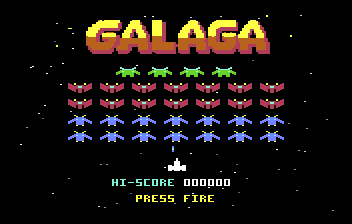
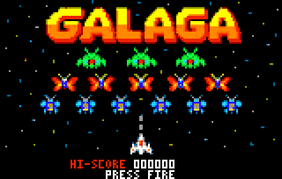
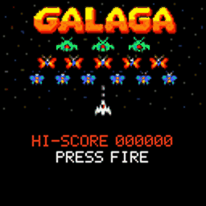
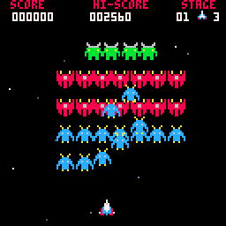
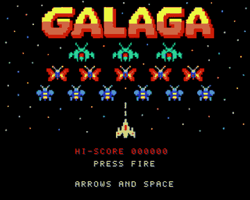

  

  <b>One arcade shooter, six machines.</b> 
  Galaga clones for the Commodore 64, the PlayStation Portable, the Atari Lynx, the Thumby Color, PICO-8 and the Commodore Amiga, written from the same game design.

  <b>Play in your browser:</b>
  <a href="https://vc64web.github.io/#openROMS=true#https://raw.githubusercontent.com/Shadester/galagas/master/c64/docs/galaga.prg"><b>▶ C64</b></a> ·
  <a href="https://shadester.github.io/galagas/pico8/"><b>▶ PICO-8</b></a> ·
  <a href="https://shadester.github.io/galagas/lynx/"><b>▶ Atari Lynx</b></a> ·
  <a href="https://vamigaweb.github.io/#AROS=true#https://raw.githubusercontent.com/Shadester/galagas/master/amiga/docs/galaga.adz"><b>▶ Amiga</b></a>

<table>
  <tr>
    <td width="360"></td>
    <td>
      <h3><a href="c64/">Commodore 64</a></h3>
      <i>6502 assembly (ACME)</i>  
      The original. A raster interrupt sprite multiplexer shows 44 sprites on 8 hardware sprites.
      Tractor beam capture, escorts, challenge stages, a title picture and SID sound.
    </td>
  </tr>
  <tr>
    <td width="360"></td>
    <td>
      <h3><a href="psp/">PlayStation Portable</a></h3>
      <i>C (PSPSDK)</i>  
      A port of the C64 rules in C, with pixel-art sprites, a glow and particle renderer and synthesised sound.
    </td>
  </tr>
  <tr>
    <td width="360"></td>
    <td>
      <h3><a href="lynx/">Atari Lynx</a></h3>
      <i>65C02 assembly (ca65)</i>  
      A port of the C64 code to the Lynx: the same rules and numbers at half the size.
      The Suzy sprite engine replaces the multiplexer. The hi-score is saved in the cartridge EEPROM.
    </td>
  </tr>
  <tr>
    <td width="360"></td>
    <td>
      <h3><a href="thumby/">Thumby Color</a></h3>
      <i>MicroPython (Tiny Game Engine)</i>  
      A port of the PSP rules to a 128 x 128 handheld, written in MicroPython. The rules run side by side with
      the C original in a test.
    </td>
  </tr>
  <tr>
    <td width="360"></td>
    <td>
      <h3><a href="pico8/">PICO-8</a></h3>
      <i>Lua (PICO-8 0.2.6b)</i>  
      A port of the Thumby Color rules to the 128 x 128 fantasy console. The rules run side by side with
      the C original in a test.
    </td>
  </tr>
  <tr>
    <td width="360"></td>
    <td>
      <h3><a href="amiga/">Commodore Amiga</a></h3>
      <i>C and 68000 assembly (m68k-elf-gcc)</i>  
      A bootable floppy that takes over the bare A500: blitter sprites, copper, Paula sound. The rules are
      <code>psp/game.c</code> itself, built without floats. A test runs it on the 68000 next to the Mac build.
    </td>
  </tr>
</table>

All of them have the same game: 32 aliens that fly in and dive, bosses that take two hits and capture your ship, a dual fighter when you rescue it, challenge stages with a perfect-clear bonus, and difficulty that rises every stage.

The C64 source is the reference for how the game must behave. The PSP, Lynx, Thumby Color, PICO-8 and Amiga games follow its rules.
Each directory has its own README with build instructions.
