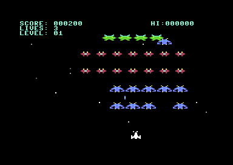

# 64galaga

A Galaga clone for the Commodore 64, written in 6502 assembly ([ACME](https://sourceforge.net/projects/acme-crossass/)).



## Features

- 32-alien formation in 5 rows: 4 bosses, 14 butterflies, 14 bees, with wing-flap animation
- **Fly-in:** at the start of each stage the aliens swoop in along curved paths in four waves and settle into the formation
- Aliens dive out of formation, steer towards you and fire back
- **Tractor beam capture:** a boss can capture your ship. Shoot that boss while it dives to free the ship and fly a **dual fighter** with double firepower. Shoot it while it is still in formation and the captive is lost
- Bosses take two hits
- Arcade scoring: 50/100 (bee), 80/160 (butterfly), 150/400 (boss, formation/diving), 1,000 for a rescue
- **Escorts:** a diving boss brings two butterflies along. Shooting the boss is worth 400, or 800 / 1,600 with one / two escorts still flying
- **Challenge stages** (3, 7, 11, ...): 32 aliens fly set paths and never shoot; points for every hit and a 10,000 bonus for a perfect clear
- Shots / hits / ratio screen after each stage
- Bonus ship at 20,000 and 70,000 points, then every 70,000
- Stage intro, respawn invulnerability, title screen, hi-score, game over
- Scrolling starfield, jingles and sound effects (SID)
- Raster interrupt sprite multiplexer: up to 44 virtual sprites on the 8 hardware sprites, with a hires player ship among multicolor sprites

## Build and run

On macOS, `tools/setup-macos.sh` installs everything via Homebrew.
Requires [ACME](https://sourceforge.net/projects/acme-crossass/) and the [VICE](https://vice-emu.sourceforge.io/) emulator (`x64sc`).

```sh
make          # builds build/galaga.prg and build/galaga.d64
make run      # builds and starts the disk image in VICE
make test     # screenshot regression tests (headless VICE); make test-update after an intended change
```

The hi-score is saved to a `hiscore` file on the disk (`make run` uses the `.d64`, so it survives between runs until the next build makes a fresh disk; the `.prg` alone just starts at 0).

The `.prg` and `.d64` also run on real hardware or other emulators (`LOAD"*",8,1` then `RUN`; the disk holds one file, `galaga`).

## Controls

| Key | Action |
|-----|--------|
| A / D | Move left / right |
| Space | Fire, start the game |
| P | Pause / resume |

A joystick in port 2 works as well. In VICE, use a keyset mapped to joystick port 2 (see `.vice/vicerc` for a WASD + Space example).

## Debug build flags

Pass to ACME (`acme -f cbm -DAUTOPLAY=1 -o out.prg src/main.asm`) for headless testing:

| Flag | Effect |
|------|--------|
| `AUTOPLAY` | Synthetic joystick input: sweeps left and right and fires |
| `NOFIRE` | With `AUTOPLAY`: no shooting during play |
| `PAUSEAT=n` | With `HALT`: press pause at frame n (used by `make test`) |
| `LIVES=n` | Start with n lives (used by `make test`) |
| `DIFF=n` | Start at difficulty n (1..8) |
| `DUAL` | Start with a dual fighter |
| `FEW` | Only three bees per stage (fast stage clears) |
| `BOSSDIVE` | Boss 1 always dives (escort test) |
| `STAGE=n` | Start at stage n (e.g. 3 for a challenge stage) |
| `FORCEPERFECT` | Challenge stages count as perfect |
| `HALT=n` | Freeze after n frames, so a screenshot is exact (used by `make test`) |
| `HALTOVER` | Freeze on the game over screen (used by `make test`) |
| `DIEAT=n` | With `HALT`: the ship is hit at frame n (used by `make test`) |
| `CAPTURE` | With `AUTOPLAY`: a boss always dives to capture, and the ship shoots it once it carries the captive |

## Source layout

`src/main.asm` holds the BASIC stub, start-up and the main loop, and includes the modules in memory order:

| File | Contents |
|------|----------|
| `constants.asm` | Hardware registers, constants, macros |
| `states.asm` | Title, stage intro, play, dying, captured, game over |
| `screen.asm` | Screen and colours, text, HUD, starfield |
| `sprites.asm` | Sprite setup, formation setup, game to multiplexer sprite copy |
| `player.asm` | Joystick, player movement, shooting |
| `enemies.asm` | Formation sway, enemy movement, dives, enemy bullets |
| `combat.asm` | Collision detection |
| `capture.asm` | Tractor beam, capture, rescue |
| `progress.asm` | Hits, scoring, player death, stage progression |
| `hiscore.asm` | Hi-score file: load at start-up, save after a new record |
| `sound.asm` | SID effects and jingles |
| `multiplexer.asm` | Raster interrupt sprite multiplexer |
| `data.asm` | Variables and tables |
| `challenge.asm` | Challenge stage logic and the shared flight path stepper (paths: see `tools/gen_paths.py`) |
| `art.asm` | Sprite art, assembled at `$3000` |
| `entry.asm` | Stage fly-in: waves, path following and homing on the formation slots (paths in generated `paths.asm`) |
