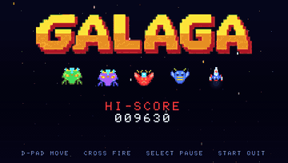

# PSP Galaga

A native PSP port of the gameplay in `64galaga` (the C64 Galaga clone), with pixel-art sprites,
a glow and particle renderer and a synthesised sound track.



## Build

### Requirements

- [PSPSDK](https://pspdev.github.io/) with its `bin` directory on `PATH`
- `make`
- PPSSPP, if you want to test in an emulator
- `cc` (host compiler) for `make test`; Python with Pillow only if you regenerate `logo.h`

```sh
make                                    # EBOOT.PBP (psp-config must be on PATH)
make test                              # host rule tests (scoring, capture, challenge stages, soak run)
```

## Run

On macOS: `tools/run.sh` (builds, then starts PPSSPP; `PPSSPP=...` overrides the binary). On a PSP, copy `EBOOT.PBP` to `PSP/GAME/PSPGALAGA/`.

## Controls

| Control | Action |
|---|---|
| D-pad or analogue stick | Move fighter |
| Cross | Start and fire (one volley for each press) |
| Select | Pause or resume (during play) |
| Start | Quit to the title screen; on the title screen, exit |

The high score is saved to `PSP/SAVEDATA/PSPGALAGA/HISCORE.DAT` on the memory stick.

## Features (same rules as 64galaga)

- 32 aliens in 5 rows (4 bosses, 14 butterflies, 14 bees) with wing-flap animation and formation sway
- Four-wave fly-in on the same spline paths as the C64 game
- Dives that peel off and steer to the player, enemy fire (max 3 shots), 8 difficulty levels
- Bosses take two hits (turn purple), escorts pay 400 / 800 / 1600 while a capture or dual fighter is active
- Tractor beam capture, captive fighter, rescue by shooting the diving boss, dual fighter
- Challenge stages 3, 7, 11, ...: four flight-path waves, points per hit, 10,000 for a perfect clear
- Stage intro, READY, invulnerable respawn, bonus ships at 20,000 and 70,000 (then every 70,000), game over
- Result screen (shots, hits, ratio), pause

## Source layout

| File | Contents |
|---|---|
| `game.c`, `game.h` | All rules, at the C64 rate of 50 ticks a second, in C64 sprite coordinates. No PSP headers |
| `main.c` | GU renderer (interpolated to 60 Hz), particles, audio synth thread, input, hi-score file |
| `art.h` | 16x16 sprite art (left half, mirrored) |
| `logo.h` | Title logo texture, generated by `tools/logo2h.py` from `assets/title-source.png` |
| `tests/test_game.c` | Host tests for the rules |
| `tools/run_shots.sh` | Debug: builds an unattended (`AUTOPLAY`) build, runs it in PPSSPP and saves BMP frames |

Debug build flags (`make EXTRA_CFLAGS=...`): `AUTOPLAY`, `START_STAGE=n`, `FORCECAPTURE`,
`SHOT_FROM=n`, `SHOT_EVERY=n`, `SHOT_MAX=n`.

To re-record `docs/gameplay.gif` (needs `ffmpeg`):

```sh
tools/run_shots.sh "-DSHOT_FROM=1 -DSHOT_EVERY=4 -DSHOT_MAX=240" 70
ffmpeg -framerate 15 -i ~/.config/ppsspp/PSP/shots/f%04d.bmp -frames:v 150 \
  -vf "scale=400:-1:flags=lanczos,split[a][b];[a]palettegen=max_colors=64[p];[b][p]paletteuse=dither=bayer:bayer_scale=5" docs/gameplay.gif
```
