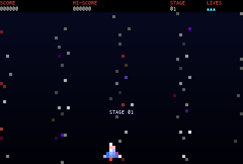

# Galaga for the terminal

A Galaga clone for the terminal, written in Rust. It plays by the rules of the arcade Galaga (see [`../ARCADE.md`](../ARCADE.md)): 40 aliens,
the arcade fly-in waves and flight paths, the dive scheduler with escorts, aimed bombs, a formation that swings and then breathes, the tractor
beam, and challenge stages. The picture is pixel art made of half-block characters in 24-bit colour; the sprites are our own.



## Build and run

You need [Rust](https://rustup.rs/). The only crate is `crossterm`.

```sh
cargo run --release            # or tools/run.sh
tools/run.sh --autoplay        # the ship plays itself
```

Use a terminal with 24-bit colour (iTerm2, kitty, WezTerm, Alacritty, GNOME Terminal, Windows Terminal; Terminal.app has 256 colours and looks worse).
The window must be at least 80 x 27 cells. The picture grows with the window: 80 x 27 (4 game pixels for a terminal pixel), 107 x 36 (3), or
160 x 52 (2). Resize the window while you play if you like.

## Controls

| Key | Action |
|-----|--------|
| A / D or the left / right arrows | Move the ship |
| Space (or K, Enter, up arrow) | Fire, start the game |
| P | Pause / resume |
| Q or Esc | Quit to the title screen; on the title screen: leave the program |
| Ctrl-C | Leave at once |

A terminal sends key presses but usually no key releases. With the kitty keyboard protocol (kitty, WezTerm, iTerm2, Ghostty, recent Alacritty) the
game gets the releases and the ship moves exactly as long as the key is down. Without it a key counts as held for a short time after the last
press or repeat: the ship moves a little after you let go, and there is a short pause before the key repeat starts. Each press fires one shot.

The hi-score is saved in `~/.local/share/galaga-tui/hiscore`.

## Options

| Option | Effect |
|--------|--------|
| `--autoplay` | Synthetic input (sweeps left and right and fires) |
| `--stage N` | Start at stage N (3 is a challenge stage) |
| `--god` | The ship cannot be hit |
| `--no-save` | Do not read or write the hi-score file |
| `--help` | Print the keys and the options |

## Tests and tools

```sh
python3 tests/test_lockstep.py [ticks] [scenario ...]   # src/game.rs against psp/game.c: the same state after every tick, 8 scenarios
python3 tests/test_terminal.py                          # the program in a pseudo-terminal: start, leave, resize, key releases
cargo test --release                                    # layout, drawing of every state, palette
python3 tools/gen_arcade_rs.py                          # src/arcade_data.rs from ../psp/arcade_data.h
python3 tools/gen_art_rs.py                             # src/art.rs from ../psp/art.h
python3 tools/make_gif.py [cols rows seconds]           # docs/gameplay.gif (needs pillow and pyte)
```

## Source layout

| File | Contents |
|------|----------|
| `src/game.rs` | The rules: a translation of `../psp/game.c`, with the same names |
| `src/arcade_data.rs`, `src/art.rs` | Generated: the arcade numbers and our pixel art |
| `src/render.rs` | The state of the game becomes a frame of terminal cells (canvas, sprites, text) |
| `src/term.rs` | Raw mode, the alternate screen, writing only the cells that changed |
| `src/input.rs` | Keys to the input of the game |
| `src/hiscore.rs`, `src/main.rs` | The hi-score file; the loop at 50 ticks a second |
| `examples/trace.rs` | Prints the state after every tick (for the lockstep test) |
